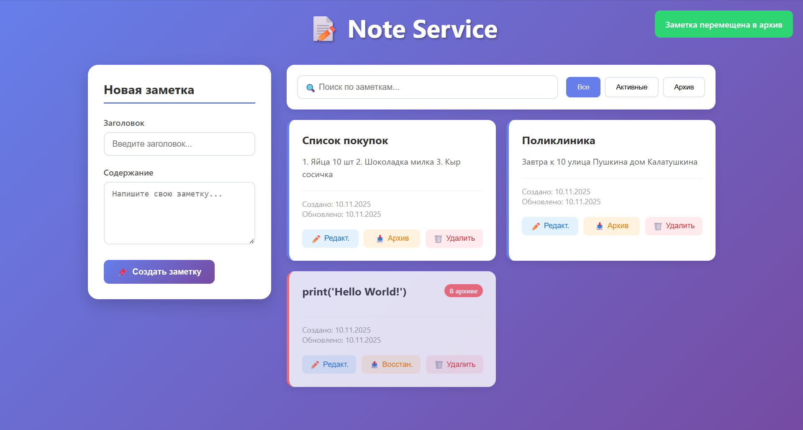

# Notes Service 📑

Простое веб-приложение для управления заметками с REST API и веб-интерфейсом.



## 📱 Функциональность

- ✅ Создание, редактирование, удаление заметок
- ✅ Архивация/восстановление заметок
- ✅ Поиск по заметкам
- ✅ Фильтрация (все/активные/архивные)
- ✅ REST API с документацией Swagger
- ✅ Адаптивный веб-интерфейс

## 🖥️ Технологии

- **Backend**: FastAPI, SQLAlchemy, Pydantic, Alembic
- **Frontend**: HTML5, CSS3, JavaScript (ES6+)
- **Database**: PostgreSQL 
- **Documentation**: Swagger

## 📂 Структура проекта

```text

notes-service/
├── alembic/                # миграции БД
├── app/
│   ├── core/               # конфигурация
│   ├── database/           # настройка БД
│   ├── models/             # SQLAlchemy модели
│   ├── schemas/            # Pydantic-схемы
│   ├── routers/            # эндпоинты API
│   ├── services/           # бизнес-логика
│   ├── static/             # HTML/CSS/JS фронтенд
│   └── main.py             # точка входа
├── alembic.ini
├── requirements.txt
└── README.md

```

## ▶️ Установка и запуск

1. Клонируйте репозиторий:

```bash
git clone <https://github.com/De-metra/notes-service.git>
cd notes-service
```

2. Установите зависимости:

```bash
pip install -r requirements.txt
```

3. Запустите приложение:

```bash
python -m uvicorn app.main:app --reload
```

## 📡 API Endpoints

1. **GET `/api/notes`** - Получить список всех заметок
2. **POST `/api/notes`** - Создать новую заметку
3. **GET `/api/notes/{id}`** - Получить заметку по ID
4. **PUT `/api/notes/{id}`** - Полностью обновить заметку
5. **PATCH `/api/notes/{id}/archive`** - Архивировать/восстановить заметку
6. **DELETE `/api/notes/{id}`** - Удалить заметку

## 👨‍💻 Автор

**De-metra**  
[](mailto:dariadunbrovskay@gmail.com)
[](https://github.com/De-metra)
